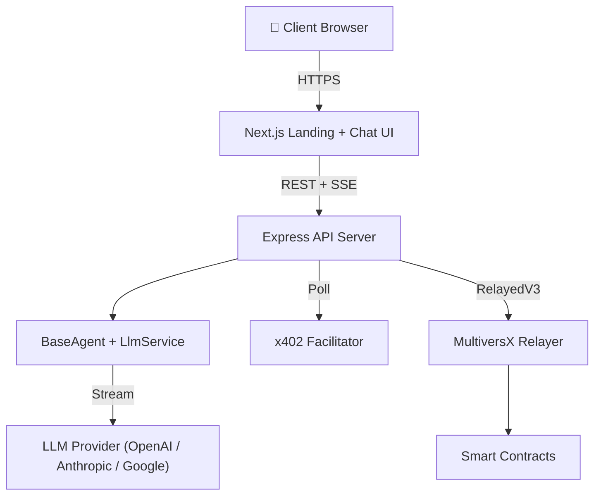

# 🚀 mx-openclaw-template-solution

> **One Command. Live AI Agent.** — Fork, launch, earn.

A complete, production-ready template for launching a monetizable AI agent on MultiversX. On-chain identity, micropayments, auto-deployment — all in one script.

---

## ⚡ One-Command Launch

```bash
git clone https://github.com/AIS-MultiversX/mx-openclaw-template-solution my-agent
cd my-agent
npm run launch
```

That's it. The script walks you through everything:

```
Step 1:   📛  Name your agent, pick your LLM, enter API key
Step 2:   🔐  Generate wallet + .env + config
Step 3:   📦  Install all dependencies
Step 4:   💰  Fund wallet from devnet faucet
Step 5:   📝  Register agent on MultiversX blockchain
Step 6:   🏗️   Build manifest + mint identity NFT
Step 7:   ✅  Build TypeScript + run all tests
Step 8:   🔒  Provision VPS (firewall, SSH hardening, Docker)
Step 9:   🚀  Deploy to VPS (docker compose up)
Step 10:  🏥  Verify — health check confirms agent is live
```

**Result:** Your agent is live at `https://yourdomain.com` — accepting queries and payments.

> Want to skip VPS and run locally? Use `npm run launch:local`

---

## 🧠 After Launch: Focus on YOUR Agent

After `npm run launch`, the only file you touch is your agent logic:

```typescript
// backend/src/agent/your-agent.ts
import { BaseAgent, Tool } from './base-agent';

export class MarketResearchAgent extends BaseAgent {
    getSystemPrompt(): string {
        return 'You are an expert market researcher. Analyze trends, compile data...';
    }

    getTools(): Tool[] {
        return [
            { name: 'search_web', description: 'Search the web', parameters: {}, execute: async (args) => '...' },
            { name: 'scrape_page', description: 'Scrape a page', parameters: {}, execute: async (args) => '...' },
        ];
    }
}
```

Push your changes → CI/CD auto-deploys. Done.

---

## 🏗️ Architecture



| Layer | Technology |
|:---|:---|
| Frontend | Next.js 15, Material Design 3, `useChat` + `usePayment` hooks |
| Backend | Express, TypeScript, SSE streaming, 98 tests |
| LLM | Generic adapter — OpenAI, Anthropic, Google (via `LLM_API_KEY`) |
| Payments | MultiversX x402, RelayedV3 (gasless) |
| Identity | Soulbound Agent NFT on Identity Registry |
| Agent API | Agent-Native endpoints (capabilities, session CRUD, job status) |
| CI/CD | GitHub Actions (lint → test → deploy), 80% coverage gate |
| Deploy | Docker Compose, Caddy (auto-SSL), hardened Ubuntu VPS |

---

## 📁 Project Structure

```
mx-openclaw-template-solution/
├── launch.sh             ← ⭐ ONE COMMAND: zero to live agent
├── backend/
│   ├── src/
│   │   ├── server.ts     ← API routes: chat, upload, agent, health
│   │   ├── agent/        ← BaseAgent (override for custom tools)
│   │   ├── llm/          ← LlmService (OpenAI / Anthropic / Google)
│   │   ├── routes/       ← Agent-Native API (capabilities, sessions, jobs)
│   │   ├── session/      ← In-memory + SQLite persistent store
│   │   ├── mx/           ← MultiversX SDK (facilitator, validator, skills)
│   │   ├── cron/         ← Proactive task scheduler
│   │   └── mcp/          ← MCP server connection
│   ├── Dockerfile
│   └── eslint.config.js
├── frontend/
│   ├── app/              ← Next.js chat + landing page
│   ├── hooks/            ← useChat, usePayment
│   └── services/         ← Typed API client
├── scripts/              ← CLI lifecycle (setup, register, fund, dev)
├── infra/                ← VPS provisioning + deploy scripts
├── deploy/               ← Caddyfile, DEPLOYMENT.md
├── .github/workflows/    ← CI + auto-deploy (Vercel + VPS)
└── docker-compose.yml    ← Full-stack orchestration
```

---

## 📋 All Commands

| Command | Description |
|:---|:---|
| **`npm run launch`** | **⭐ One command — zero to live agent** |
| `npm run launch:local` | Same but skip VPS, run locally |
| `npm run setup` | Interactive setup wizard (just config, no deploy) |
| `npm run dev` | Start local dev servers |
| `npm run register` | Register agent on MultiversX |
| `npm run fund` | Get devnet faucet tokens |
| `npm run balance` | Check wallet balance |
| `npm run provision -- root@IP` | Harden a VPS |
| `npm run deploy -- user@IP domain` | Deploy to VPS |
| `npm run logs -- user@IP` | Tail logs on VPS |
| `npm run destroy -- user@IP` | Tear down deployment |

### Backend-specific

| Command | Description |
|:---|:---|
| `cd backend && npm test` | Run all 98 tests |
| `cd backend && npm run lint` | ESLint check |
| `cd backend && npm run lint:fix` | Auto-fix lint issues |
| `cd backend && npm run test:coverage` | Coverage report (≥80%) |

---

## 🔧 Configuration

| Variable | Default | Description |
|:---|:---|:---|
| `LLM_API_KEY` | — | Your LLM provider API key |
| `LLM_PROVIDER` | `openai` | `openai`, `anthropic`, or `google` |
| `LLM_MODEL` | `gpt-4o` | Model name |
| `PRICE_PER_QUERY` | `0.50` | Price in USDC per query |
| `AGENT_NAME` | `my-openclaw-bot` | On-chain agent name |
| `MULTIVERSX_CHAIN_ID` | `D` | `D` for devnet, `1` for mainnet |

See `.env.example` for the full list (30+ variables).

---

## 🔒 Security

- **Non-root Docker** containers
- **UFW firewall** (SSH + HTTP/S only)
- **Fail2Ban** brute-force protection
- **SSH key-only** auth (passwords disabled)
- **Caddy auto-SSL** (Let's Encrypt)
- **Secrets isolation** — `.env` and `wallet.pem` never committed
- **Zero-leak model** — 3 layers: `.env.example` (docs) → GitHub Secrets (CI) → VPS `.env` (runtime)
- **Rate limiting** + Helmet + CORS on all API endpoints

---

## 🔄 Push-to-Deploy (CI/CD)

After initial launch, every `git push` triggers:

```
Push → Lint (0 errors) → Test (≥80% coverage) → Deploy (frontend + backend)
```

Frontend deploys to Vercel. Backend deploys to VPS via SSH + Docker. Both are **optional and swappable** — see `deploy/DEPLOYMENT.md` for alternative providers.

---

## 🧪 Testing

```bash
cd backend && npm test          # 98 tests, 8 suites
cd backend && npm run lint      # 0 errors, ESLint flat config
cd backend && npm run test:coverage  # 81.4% line coverage
```

---

## 📜 License

MIT — Built with ❤️ on MultiversX
