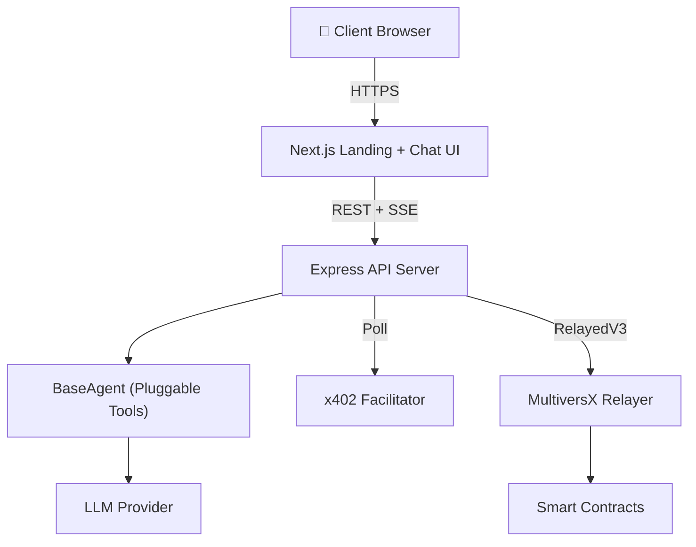

# 🧩 mx-openclaw-template-solution

> **Zero-to-Production AI Agent in 5 Minutes** — Built on MultiversX

A complete, deployable template for launching a monetizable AI agent with on-chain identity, reputation, and x402 micropayments. Clone, configure, deploy.

---

## ⚡ Quick Start

```bash
# 1. Clone (10 seconds)
git clone https://github.com/AIS-MultiversX/mx-openclaw-template-solution my-agent
cd my-agent

# 2. Setup wizard (60 seconds)
npm run setup

# 3. Fund wallet (Devnet, 30 seconds)
npm run fund

# 4. Register on-chain (30 seconds)
npm run register

# 5. Deploy to VPS (120 seconds)
npm run provision -- root@YOUR_VPS_IP
npm run deploy -- moltbot@YOUR_VPS_IP yourdomain.com

# 🎉 Live at https://yourdomain.com
```

---

## 🏗️ Architecture



### Stack
| Layer | Technology |
|:---|:---|
| Frontend | Next.js 15, Material Design 3, CSS Modules |
| Backend | Express, TypeScript, SSE streaming |
| Payments | MultiversX x402, RelayedV3 (gasless) |
| Identity | Soulbound Agent NFT on Identity Registry |
| Deploy | Docker Compose, Caddy (auto-SSL), Ubuntu VPS |

---

## 📁 Project Structure

```
mx-openclaw-template-solution/
├── backend/              ← Express API + Agent engine
│   ├── src/
│   │   ├── server.ts     ← Routes: /api/chat, /api/upload, /api/agent...
│   │   ├── agent/        ← BaseAgent interface (override for custom tools)
│   │   ├── session/      ← In-memory session store
│   │   └── mx/           ← MultiversX SDK (facilitator, validator, skills)
│   └── Dockerfile
├── frontend/             ← Next.js chat landing page
│   ├── app/
│   │   ├── page.tsx      ← Landing page (hero + features)
│   │   └── chat/page.tsx ← Full-screen chat interface
│   └── Dockerfile
├── scripts/              ← CLI lifecycle (setup, register, fund, dev)
├── infra/                ← Docker Compose, Caddy, provision/deploy scripts
├── agent.config.example.json
└── .env.example
```

---

## 🔧 Configuration

### Environment Variables

| Variable | Default | Description |
|:---|:---|:---|
| `MULTIVERSX_CHAIN_ID` | `D` | `D` for devnet, `1` for mainnet |
| `LLM_PROVIDER` | `openai` | `openai`, `anthropic`, or `google` |
| `LLM_API_KEY` | — | Your LLM provider API key |
| `PRICE_PER_QUERY` | `0.50` | Price in USDC per agent query |
| `AGENT_NAME` | `my-openclaw-bot` | On-chain agent name |

See `.env.example` for the full list.

---

## 🔌 Creating a Derivative (Custom Bot)

This template is agent-agnostic. To create your own bot:

1. **Fork** this repository
2. **Add tools** in `backend/src/agent/tools/`
3. **Extend BaseAgent** in `backend/src/agent/your-agent.ts`

```typescript
import { BaseAgent, Tool } from './base-agent';

export class MarketResearchAgent extends BaseAgent {
  getSystemPrompt(): string {
    return 'You are an expert market researcher...';
  }

  getTools(): Tool[] {
    return [
      { name: 'search_web', description: '...', parameters: {}, execute: async (args) => '...' },
      { name: 'scrape_page', description: '...', parameters: {}, execute: async (args) => '...' },
    ];
  }
}
```

---

## 📋 CLI Commands

| Command | Description |
|:---|:---|
| `npm run setup` | Interactive setup wizard |
| `npm run register` | Register agent on MultiversX |
| `npm run fund` | Get devnet faucet tokens |
| `npm run balance` | Check wallet balance |
| `npm run dev` | Start local dev servers |
| `npm run provision -- root@IP` | Harden a VPS |
| `npm run deploy -- user@IP domain` | Deploy to VPS |
| `npm run logs -- user@IP` | Tail logs on VPS |
| `npm run destroy -- user@IP` | Tear down deployment |

---

## 🧪 Testing

```bash
# Backend tests (29 passing)
cd backend && npm test

# All tests from root
npm test
```

---

## 🔒 Security

- **Non-root Docker** containers
- **UFW firewall** (SSH + HTTP/S only)
- **Fail2Ban** active
- **SSH key auth** (passwords disabled)
- **Caddy auto-SSL** (Let's Encrypt)
- **Secrets isolation** (.env and wallet.pem never committed)

---

## 📜 License

MIT — Built with ❤️ on MultiversX
